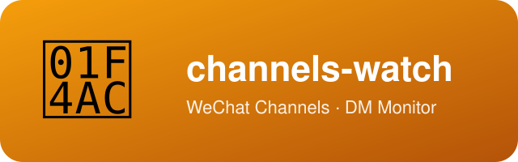

<div align="center">
  

  [](LICENSE.md)
  [](CHANGELOG.md)
  [](#)
  [](https://github.com/xhqing)

  [English](README.md)
</div>

# channels-watch（视频号私信监控）

监控微信视频号助手（channels.weixin.qq.com）的私信页：**「打招呼消息」或「私信」出现新内容时，推送到你的手机**。

## 特性

- **只读**：只切换「打招呼消息 / 私信」两个列表页看内容，不点进会话、不发送任何消息；
- **低频**：默认 5 分钟检查一次；
- **本地**：登录态、消息内容全部在本机处理；推送只发「有新消息」的摘要；
- **多通道**：支持飞书机器人 / ntfy / Server酱，配置切换；
- **故障提醒**：登录态失效时会推送提醒，不会静默漏消息。

## 工作原理

- 用 Playwright 驱动本机 Chrome，打开视频号助手的私信页（登录态保存在本地 `profile/` 目录）；
- 每轮抓取「打招呼消息 / 私信」两个列表的会话快照，与上一轮对比（新出现的会话、由已读变未读的会话）；
- 有变化时，把摘要通过你配置的通道推送到手机；
- 会话条目上的「时间文案」（如「刚刚」「5 分钟前」）在对比时被剔除，避免时间显示变化造成误报。

## 快速开始

### 前置要求

- macOS（launchd 定时方案仅限 macOS）；
- [Google Chrome](https://www.google.com/chrome/)（脚本以系统 Chrome 驱动）；
- Python 3.11 或更高版本。

### 第 1 步：获取代码并安装依赖

```bash
git clone https://github.com/xhqing/channels-watch.git
cd channels-watch
pip3 install playwright
```

### 第 2 步：配置推送通道

**方案 A：飞书（推荐，免费稳定）**

> 注意：飞书的「自定义机器人」**只能用电脑端添加**（官方限制，手机 App 上没有这个选项）。
> 手机 App 只用于接收消息。

1. 在 Mac 上安装飞书桌面版（或打开 [feishu.cn](https://www.feishu.cn) 的桌面端；手机 App 也装上用于收消息）；
2. 在飞书里新建一个群（只拉自己/小号即可）；
3. **电脑端**进入该群 → 右上角「···」→ 设置 → 群机器人 → 添加机器人 → 选「**自定义机器人**」→ 设置名称头像 → 复制 **Webhook 地址**（形如 `https://open.feishu.cn/open-apis/bot/v2/hook/xxxx`）；
4. 复制配置模板并填入 Webhook 地址：

```bash
cp config.example.json config.json
```

```json
{
  "push": {
    "channel": "feishu",
    "feishu_webhook": "https://open.feishu.cn/open-apis/bot/v2/hook/你的地址"
  }
}
```

测试推送（手机应立刻收到）：

```bash
curl -X POST -H "Content-Type: application/json" \
  -d '{"msg_type":"text","content":{"text":"channels-watch 测试消息"}}' \
  "你复制的webhook地址"
```

**方案 B：ntfy（开源，Android 直接装 App）**

1. Android 装 ntfy（Google Play 或 F-Droid 搜 `ntfy`）；
2. App 里订阅一个**随机、不易猜**的主题名（如 `sph-watch-8f3k2m`，主题名就是密码）；
3. 编辑 `config.json`：

```json
{
  "push": {
    "channel": "ntfy",
    "ntfy": { "server": "https://ntfy.sh", "topic": "sph-watch-8f3k2m" }
  }
}
```

测试（手机应立刻收到）：

```bash
curl -d "channels-watch 测试消息" ntfy.sh/sph-watch-8f3k2m
```

> 若 ntfy.sh 在国内网络不稳定，可自建服务端后把 `server` 改成自建地址；
> 或直接用飞书方案。

**方案 C：Server酱**

在 [sct.ftqq.com](https://sct.ftqq.com) 申请 SendKey 后：

```json
{
  "push": {
    "channel": "serverchan",
    "serverchan_key": "你的SendKey"
  }
}
```

### 第 3 步：首次扫码登录

```bash
python3 watch.py --login
```

弹出的 Chrome 窗口里，用**绑定视频号的微信**扫码登录。登录成功后窗口自动关闭，
登录态保存在 `profile/` 目录（之后一般不需要重复登录）。

> 登录态被服务端吊销后，登录页会先尝试「记住账号快速登录」（显示上次登录的账号名和「登录中...」），通常 10~15 秒内自动完成、无需扫码——`--login` 会自动等待它完成。

### 第 4 步：验证

```bash
python3 watch.py --check     # 检查登录状态 + 看能否抓到会话列表
python3 watch.py --once      # 手动跑一次监控（有更新会推送）
```

用另一个微信号给你的视频号发一条私信/打招呼，再跑 `--once`，手机应收到推送。

### 第 5 步：设置定时（二选一）

**方式 A：launchd 定时任务（推荐，开机自启、后台静默）**

```bash
# 先编辑 com.xhq.channels-watch.plist：把三处路径（ProgramArguments、
# WorkingDirectory、日志路径）改成服务实际运行的目录——
# 生产副本 ~/.local/share/channels-watch（见下文「生产部署」），
# 不用生产副本时就是你的 clone 目录
cp com.xhq.channels-watch.plist ~/Library/LaunchAgents/
launchctl load ~/Library/LaunchAgents/com.xhq.channels-watch.plist
```

- 每 5 分钟自动跑一次，日志在 `logs/`；
- 停止：`launchctl unload ~/Library/LaunchAgents/com.xhq.channels-watch.plist`

**方式 B：前台循环（调试用）**

```bash
python3 watch.py --loop
```

## 生产部署（运行已安装副本）

上面的「快速开始」直接用 clone 目录运行，试用够用；如果打算长期挂着监控，建议装一份**生产副本**，让 launchd 只跑它——之后 clone 里的改动、实验、`git pull` 都不再影响正在运行的服务。

```bash
# 1. 下载最新 Release 并解压
gh release download --repo xhqing/channels-watch --archive=tar.gz --dir /tmp/cw-release
tar -xzf /tmp/cw-release/channels-watch-*.tar.gz -C /tmp/cw-release

# 2. 把脚本装进生产目录
mkdir -p ~/.local/share/channels-watch
cp /tmp/cw-release/channels-watch-*/watch.py ~/.local/share/channels-watch/

# 3. 把运行时数据放到脚本旁边（首次迁移把 clone 里已有的移过来，全新使用则跳过）
#    config.json、state.json、profile/、logs/ 都与 watch.py 同目录
mv config.json state.json profile logs ~/.local/share/channels-watch/

# 4. 装 launchd 任务：先把 plist 里的三处路径改成 ~/.local/share/channels-watch，再加载
cp com.xhq.channels-watch.plist ~/Library/LaunchAgents/
launchctl load ~/Library/LaunchAgents/com.xhq.channels-watch.plist
```

> 没装 GitHub CLI 的话，第 1 步改为从 [Releases 页面](https://github.com/xhqing/channels-watch/releases) 下载「Source code (tar.gz)」压缩包。

**升级**：下载新 Release，只替换生产目录里的 `watch.py`（`config.json`、`state.json`、`profile/`、`logs/` 原样保留），launchd 任务不动——下一轮就用上新代码。不要把生产目录当 git 仓库 `git pull`；开发一律在 clone 里做。

**开发调试**：在 clone 里开发；开发运行需要线上登录态时，把生产目录的 `profile/` 复制过来，或在 clone 里跑 `python3 watch.py --login` 建一份独立登录态。

## 常见问题

**Q：登录态多久失效？失效了怎么办？**
服务端会不定期吊销网页登录态，实测有不到一天就被吊销的情况（具体周期不定）。

大多数情况下**不需要扫码**：登录页会先尝试「记住账号快速登录」（显示上次登录的
账号名和「登录中...」），通常 10~15 秒内自动完成；脚本已内置 40 秒宽限等待，
快速登录能完成时监控会自动恢复，不会提醒。

只有当脚本提醒「登录失效」——也就是宽限期内快速登录也没成功、页面要求扫码时，
才需要运行 `python3 watch.py --login` 重新扫码（在服务实际运行的目录里跑——装了生产副本就是生产目录）。

**Q：收不到推送，怎么排查？**
1. 先手动跑一次测试推送命令（见第 2 步），排除推送通道本身的问题；
2. 看 `logs/` 里最新日志，确认是「无更新」还是报错；
3. 若是「抓不到会话」（页面改版），运行 `python3 watch.py --dump`，
   它会保存截图和页面结构信息，把结果发到 [Issues](https://github.com/xhqing/channels-watch/issues) 反馈。

**Q：会不会误报？**
会尽量去重（已读状态 + 内容指纹），但页面上的「时间文案」变化等原因可能带来少量重复提醒。

**Q：会不会影响视频号账号？**
脚本是「只读 + 低频」的最保守形态，但仍属于《微信视频号运营规范》4.3 条
（第三方工具接入）的灰色地带，无法承诺零风险。建议先低频运行一两周观察账号状态。

## 目录结构

```
channels-watch/
├── watch.py                    # 主脚本
├── config.example.json         # 配置模板（复制为 config.json 后修改）
├── config.json                 # 你的配置（含 Webhook 等敏感信息，不入库）
├── com.xhq.channels-watch.plist# launchd 定时任务模板（macOS）
├── assets/logo.svg             # 项目 logo
├── profile/                    # 浏览器登录态（自动生成，勿动）
├── logs/                       # 运行日志（自动生成）
├── state.json                  # 去重状态（自动生成）
├── CHANGELOG.md                # 变更记录
└── VERSION                     # 版本号
```

`config.json`、`state.json`、`profile/`、`logs/` 都生成在 `watch.py` 所在目录——从 clone 运行就在 clone 里，装了生产副本就在生产目录里。

## 运行环境

- macOS（本机已验证：Python 3.11 + Playwright + Google Chrome）；
- 需要保持 Mac 开机联网（或至少在你希望监控的时段开机）。

## License 与署名

Copyright (c) 2026 All Contributors. 以 [MIT 许可证](LICENSE.md)发布。

引用署名：如果你使用或引用本项目，请保留版权声明并注明来源：[channels-watch](https://github.com/xhqing/channels-watch)。
